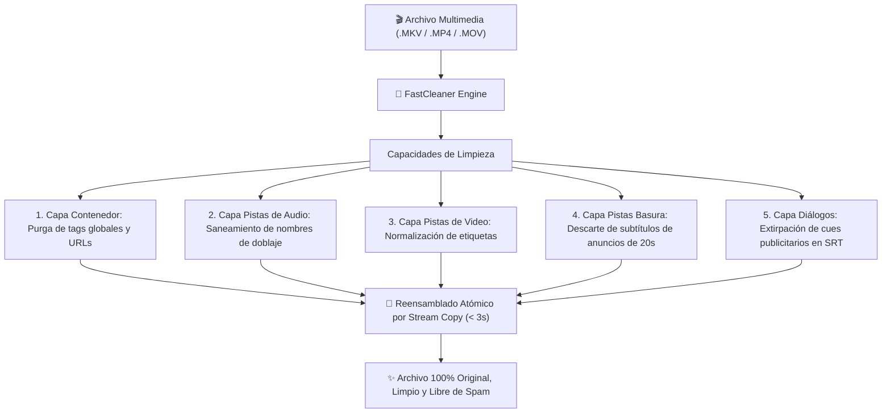

# 🧹 FastCleaner

> **Deep Video Metadata Sanitizer, Track Renamer & Subtitle Spam Purger**  
> Inspirado en la simplicidad de **ExifCleaner**, pero diseñado con un motor de inspección multimedia profunda de **5 capas** para limpiar metadatos globales, sanitizar etiquetas de pistas individuales de audio/video, descartar subtítulos publicitarios y extirpar marcas de agua dentro de los diálogos de películas en **menos de 3 segundos sin pérdida de calidad**.

---

## ⚡ ¿Por qué ExifCleaner no es suficiente para Video?

Herramientas populares como **ExifCleaner** utilizan internamente *ExifTool*, que fue concebido para fotografías (JPEG/TIFF/RAW) y documentos (PDF). En archivos de video modernos (`.mkv`, `.mp4`, `.mov`), las herramientas convencionales tienen serias limitaciones:

| Capacidad de Limpieza | ExifCleaner (ExifTool) | 🧹 FastCleaner Pro |
| :--- | :---: | :---: |
| **Metadatos Globales del Contenedor** | ✅ Borra tags básicos | ✅ **Purga profunda de todos los átomos/metadatos** |
| **Títulos de Pistas de Audio** (`title="WwW.SitioPirata.com"`) | ❌ **No puede modificarlos** | ⚡ **Sanitiza a nombres limpios (`Español Latino`)** |
| **Títulos de Pistas de Video** (`title="1080p WebRip"`) | ❌ **No puede modificarlos** | ⚡ **Sanitiza a estándar canónico** |
| **Detección de Pistas de Subtítulos Basura (Anuncios)** | ❌ **Ciego a streams internos** | 🗑️ **Descarta pistas completas de publicidad (<30s)** |
| **Extirpación de Spam DENTRO de Diálogos (SRT/VTT)** | ❌ **No tiene parser de texto** | 💬 **Elimina URLs intermedias preservando el 100% de diálogos** |
| **Velocidad y Calidad** | ⚠️ Variable | 🚀 **Stream Copy 100% Sin Pérdida (< 3 segundos)** |
| **Interfaz Web Drag & Drop Interactiva** | ✅ Sí (Electron pesado ~200MB) | ✨ **Web Glassmorphic Nativa (Cero dependencias)** |
| **Soporte CLI y Procesamiento por Lotes (Batch)** | ❌ No | ✅ **`fastcleaner /carpeta/`** |

---

## 🏗️ Las 5 Capas del Motor de Sanitización



---

## 📦 Instalación Rápida

### 📥 Instalación en 1 Línea (macOS & Linux):

```bash
curl -sSL https://raw.githubusercontent.com/edwardrcastillo/fastcleaner/main/install.sh | bash
```

---

## 💻 Modos de Uso

### 1. 🖱️ Interfaz Gráfica Web Drag & Drop (Estilo ExifCleaner)

Inicia el servidor visual interactivo:
```bash
fastcleaner --gui
```
Abre tu navegador en `http://localhost:8099` y **arrastra archivos o carpetas completas**. La interfaz procesará las películas en paralelo y mostrará el informe detallado:
* Metadatos de contenedor eliminados.
* Pistas de audio saneadas.
* Cantidad exacta de fragmentos de subtítulos publicitarios extirpados.
* Tiempo total de procesamiento (habitualmente **1.5s - 3s** por película).

---

### 2. ⚡ Modo CLI Individual (Instantáneo)

Sanitiza un archivo `.mkv` o `.mp4` en el lugar:
```bash
fastcleaner "/Users/edward/Desktop/Pelicula.mkv"
```

O especificando una ruta de salida diferente:
```bash
fastcleaner "origen.mkv" -o "destino_limpio.mkv"
```

---

### 3. 📂 Modo Lote (Carpetas Completas)

Recorre recursivamente toda una biblioteca o disco duro y sanea automáticamente todas las películas y series encontradas:
```bash
fastcleaner "/media/Peliculas/"
```

---

## 🎯 Caso de Estudio Real: *Guten Tag, Ramón (2013)*

En las copias distribuidas en la web de esta película:
1. **Contenedor:** Tenía el título `WwW.PeliculasGoogleDrive.info`.
2. **Pista de Audio 5.1:** Estaba etiquetada como `WwW.PeliculasGoogleDrive.info`.
3. **Pista de Subtítulos 1:** Era un anuncio basura de 20 segundos que mostraba `...:::wWw.DescargateloCorp.CoM:::...`.
4. **Pista de Subtítulos 2:** Tenía los **571 diálogos reales** en español para las escenas en alemán, pero el primer diálogo contenía publicidad de `www.DescargateloCorp.com`.

**Resultado con FastCleaner:**
* Se descartó automáticamente la pista 1 de 20 segundos.
* Se extirpó el cue publicitario inicial de la pista 2, **preservando intactos los 570 diálogos cinematográficos legítimos**.
* Se renombró la pista de audio a `Español Latino (AC3 5.1)`.
* Se marcó el subtítulo limpio con flags `default + forced`.
* **Tiempo de ejecución:** **2.8 segundos** sin retranscodificar video ni audio.

---

## 📄 Licencia

MIT License © 2026 Edward Castillo (FastMovie Team)
